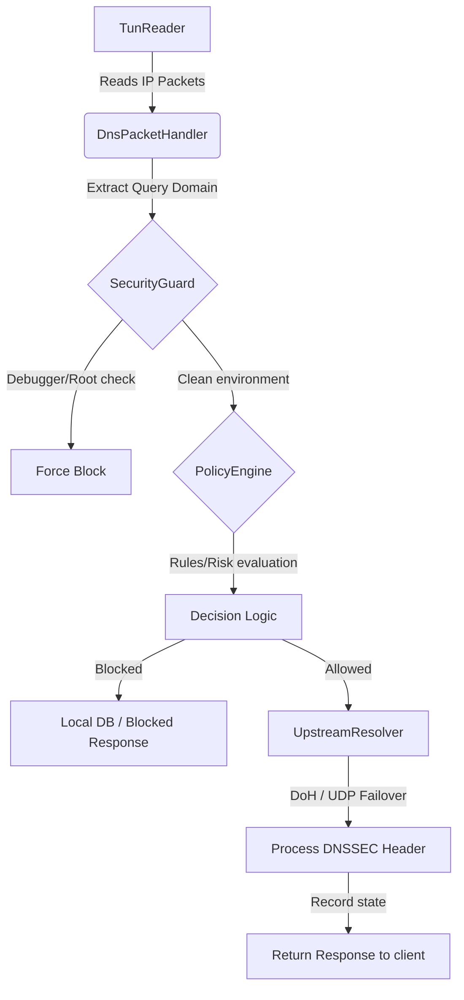

# Architectural Overview — TrustPhone DNS

This document details the high-performance, low-memory architectural design of TrustPhone DNS.



## Local VPN Service & TunReader
TrustPhone DNS intercepts network traffic using Android's native `VpnService` API:
* **TunReader**: Continually polls the file descriptor of the virtual network interface (`TUN`) in the background using co-routines, isolating DNS packets (destination port 53) from general application traffic.
* **Socket Protection**: All upstream sockets are registered with `VpnService.protect()` to prevent routing loops.

## The Matching Engine (Bloom + SQLite)
To match domains against 1,000,000+ blocklist entries under a strict memory footprint limit of `< 10MB`, we use a dual-stage pipeline:
1. **In-Memory Bloom Filter**: A space-efficient probabilistic data structure that holds all blocked domain hashes. It operates in under 1.5MB of RAM for 1 million entries.
2. **On-Disk SQLite Database (Room)**: When a Bloom Filter hit is detected, a secondary query checks the indexed Room database to confirm or reject false positives.

```
Incoming Query (e.g. ad.example.com)
  │
  ├──► Check Bloom Filter (In-memory, ~1.4MB)
  │      ├──► No: Allow domain instantly
  │      └──► Yes (Possible match): Query Room DB (On-disk)
  │             ├──► Exists: Block domain
  │             └──► Not exists (False Positive): Allow domain
```

## Upstream Resolver & DoH Failover
All allowed DNS queries are forwarded by the `UpstreamResolver` using the following policies:
* **Primary DoH**: HTTPS post/get requests to the default resolver configured via Firebase Remote Config.
* **Secondary/Fallback**: Automatic transition to secondary DoH servers or local ISP UDP resolvers in case of consecutive failures (3+ failed attempts).
