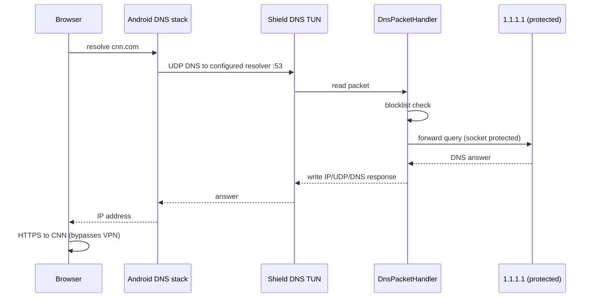

# DNS VPN Deep Analysis — Why Pages Failed to Load

## Architecture (how Shield DNS is supposed to work)



Shield DNS is a **DNS-only** filter. It must:
1. Intercept **only DNS UDP** packets via TUN
2. Answer or forward them
3. Let **all other traffic** (TCP/HTTPS) use the normal network

## Root causes found (ranked)

### 1. CRITICAL — Public DNS routes blackholed TCP (DoT/DoH)

**File:** `DnsBlockerService.kt` (previous code)

```kotlin
CAPTURED_DNS_RESOLVERS.forEach { builder.addRoute(it, 32) }
// 1.1.1.1, 8.8.8.8, 8.8.4.4, 9.9.9.9, ...
```

`addRoute(X, 32)` sends **all** traffic to IP `X` through the VPN TUN — not just DNS.

The app only handles `protocol == UDP` in `onTunPacket()`. **TCP is silently dropped.**

Samsung/Android often uses **DNS-over-TLS** (port 853) or **DNS-over-HTTPS** (port 443) to 8.8.8.8 / 1.1.1.1. Those TCP packets entered TUN and were **never answered** → DNS completely broken.

### 2. CRITICAL — Full tunnel `0.0.0.0/0` blackholed all HTTPS (earlier builds)

Earlier code used:

```kotlin
.addRoute("0.0.0.0", 0)
```

That routes **every IPv4 packet** through TUN. Since only DNS UDP is implemented, **all TCP/HTTPS was dropped** → no pages load even if DNS worked.

### 3. HIGH — Wrong DNS VPN pattern (virtual 10.0.0.2 as DNS)

Previous code used:

```kotlin
.addDnsServer("10.0.0.2")  // virtual IP
.addRoute("10.0.0.0", 30)
```

Many working DNS blockers use the **public resolver pattern**:

```kotlin
.addDnsServer("1.1.1.1")
.addRoute("1.1.1.1", 32)   // only DNS server IP through TUN
```

System sends DNS to 1.1.1.1 → TUN intercepts UDP/53 → app forwards with `protect()` → responds. All website TCP goes directly to the internet.

### 4. HIGH — Samsung Private DNS bypass/conflict

**Settings → Connections → Private DNS**

If set to Automatic or a provider, Android encrypts DNS outside the VPN. Combined with broken routes (cause #1), nothing resolves.

**User action required:** Private DNS → **Off**

### 5. MEDIUM — Upstream socket loop without `protect()`

When resolver IPs are routed through TUN, the app's own UDP forward to 1.1.1.1 must use `VpnService.protect(socket)` or queries loop back into TUN forever.

`protect()` was added but was useless while routes were wrong.

### 6. MEDIUM — Silent packet drops

When `handleUdpDns()` returns `null`, **no DNS response is sent**. The client sees a timeout ("DNS address could not be found").

Causes: malformed packets, non-A/AAAA blocked types, upstream failure before SERVFAIL fix.

### 7. LOW — Blocklists are NOT the cause

`cnn.com` / `google.com` are not in the blocklist. The malware list blocks trackers/ads, not entire sites. Activity log would show blocks, but root domains would still resolve.

## What was fixed

| Change | Why |
|--------|-----|
| `addDnsServer("1.1.1.1")` + `addRoute("1.1.1.1", 32)` only | Proven DNS-only pattern |
| Removed routes to 8.8.8.8, 9.9.9.9, etc. | Stops TCP blackhole for DoT/DoH |
| `protect()` on upstream sockets | Prevents resolver loop |
| Forward to packet's destination resolver IP | Correct spoofed response source |
| Parse upstream IP without DNS lookup | Avoids circular resolution |
| UDP checksum 0 on TUN responses | Android TUN compatibility |
| MTU 1280 | Safer on mobile networks |
| SERVFAIL on upstream failure | Client gets error instead of silence |

## User checklist after fix

1. **Disconnect** Shield DNS
2. Set **Private DNS → Off** (Samsung)
3. **Connect** protection again
4. Test google.com, then cnn.com

## If still broken

- Check Settings → Shield DNS → Upstream DNS is `1.1.1.1`
- Turn off DoH temporarily in app Settings
- Confirm VPN permission granted
- Run `adb logcat -s DnsBlockerService` (debug build) while opening a site
